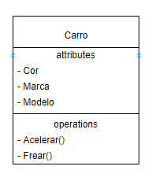

# Classe

  ## Definição

    Uma classe é um elemento do código Java que utilizamos para representar objetos reais ou não. 
    Dentro dela é comum declararmos atributos e métodos, que representam, as características e comportamentos desse objeto. 

  ### Representação de classe e objeto na UML
  
  
  
  ### Diferença entre classe e objeto
      
    A analogia seria de Receita de um bolo e um bolo
    Uma classe Bolo você não come. Mas se você construir um novo bolo esse sim você pode comer. 
    a class Bolo é a receita. O objeto bolo é o bolo em si, que podem ter pesos diferentes
  
  ## Atributos
    
    Os atributos são as propriedades de um objeto, também são conhecidos como variáveis ou campos. 
    Essas propriedades definem o estado de um objeto, fazendo com que esses valores possam sofrer alterações.
  ```java

    public class Cachorro{
      public String nome;
      public int peso;
      public String corOlhos;
      public int quantPatas;
      
    }

  ```
      
  ## Métodos
    
    Um método em Java é equivalente a uma função, subrotina ou procedimento em outras linguagens de programação.
    
    Um método é um bloco de código ou coleção de instruções ou um conjunto de códigos agrupados para executar uma tarefa ou operação.
    É usado para alcançar a reutilização do código. Nós escrevemos um método uma vez e o usamos várias vezes.
    Ele também fornece a fácil modificação e legibilidade do código. O método é executado apenas quando o chamamos ou o invocamos.
     
  ```java
  
    public static void  main (String [] args) {  
      System.out.print ("Hello World");  
    }  
    
  ```
  ## Construtor
  
    O método construtor determina quais ações devem ser executadas quando da criação de um objeto.
    Em Java, o construtor é definido como um método cujo nome deve ser o mesmo nome da classe e sem indicação de retorno nem void. 
    O construtor é unicamente invocado no momento da criação do objeto através do operador new.
  ```java

    public class Carro{
    /* CONSTRUTOR DA CLASSE Carro */
      public Carro(){
        //Faça o que desejar na construção do objeto
      }
    }

  ```
  
  ## Objeto
  
    Uma entidade que possui estado e comportamento é conhecida como um objeto, por exemplo, cadeira, bicicleta, caneta, carro, etc.
    Um objeto é uma instância de uma classe. Uma classe é um modelo ou blueprint a partir do qual os objetos são criados. Portanto, um objeto é a instância (resultado)
    Um objeto tem três características:

    Estado: representa os dados (valor) de um objeto.
    
    Comportamento: representa o comportamento (funcionalidade) de um objeto, como depósito, retirada, etc.
    
    Identidade: uma identidade de objeto geralmente é implementada por meio de um ID exclusivo. O valor do ID não é visível para o usuário externo. No entanto, é usado internamente pela JVM para identificar cada objeto exclusivamente.
    
    Por exemplo, caneta é um objeto. O nome é Reynolds; a cor é branca, são conhecidos como estado. É usado para escrever, então escrever é o seu comportamento.
  
  ## Inicialização de um objeto
  
  ```java

  public class TestaCaes {
    public static void main(String[] args) {
      Cachorro cachorro1 = new Cachorro();
    }
  }

  ```
  
  ## Utilização de um objeto
  
  ```java
    public class TestaCaes {
      public static void main(String[] args) {
        Cachorro cachorro1 = new Cachorro();
        cachorro1.nome = "Pluto";
        cachorro1.corOlhos = "azuis";
        cachorro1.peso = 53;
        cachorro1.quantPatas = 4;
      }
    }
  
  ```
  
  ## Comparação de objetos
  
  ## Método toString
  
  ## Visibilidade de atributos e métodos
  
  ### Público
  
  ### Privado
  
  ## Sobrecarga de métodos
  
  ## Sobrecarga de construtores

    
